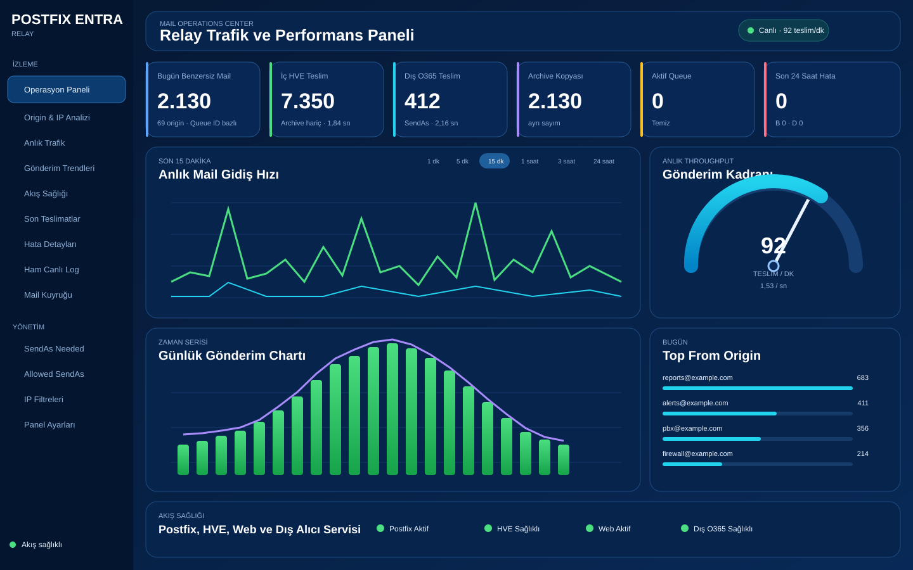
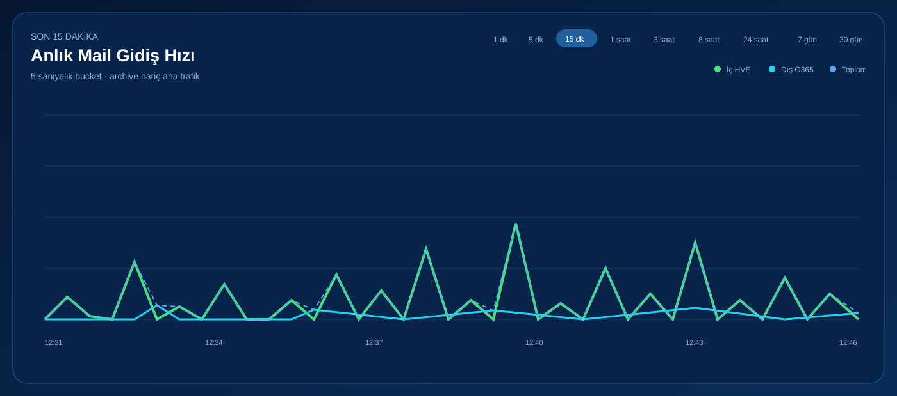
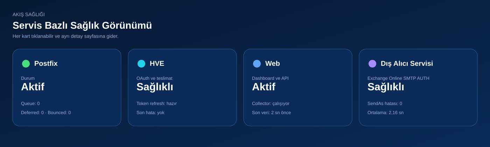
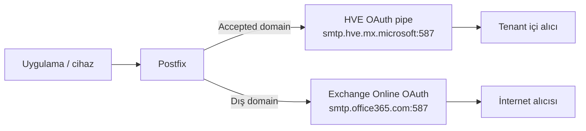

# Postfix Entra Relay

> Microsoft 365 için üretim odaklı, OAuth tabanlı **split mail relay** referans projesi. Postfix; Microsoft 365 tenant içindeki alıcıları **High Volume Email (HVE)** üzerinden, dış alıcıları ise **Exchange Online SMTP AUTH + OAuth** üzerinden gönderir.

[English summary](README.en.md) · [Uçtan uca Türkçe kurulum](docs/tr/DEPLOYMENT_GUIDE.md) · [English deployment guide](docs/en/deployment-guide.md) · [Güvenlik](SECURITY.md)

## Dashboard görünümü

Aşağıdaki görseller, gerçek tenant ve müşteri verisi içermeyen **sanitized demo ekranlarıdır**.

### Genel görünüm

[](docs/screenshots/dashboard-overview.svg)

### Anlık trafik

[](docs/screenshots/dashboard-live-throughput.svg)

### Akış sağlığı

[](docs/screenshots/dashboard-flow-health.svg)

## Ne çözer?

Uygulamalar, yazıcılar, santraller, rapor servisleri ve eski cihazlar genellikle tek bir SMTP relay'e mail bırakır. Normal Exchange Online SMTP AUTH yolu mailbox başına hız ve günlük alıcı sınırlarına tabidir. HVE ise yüksek hacimli **tenant içi** mail için ayrı bir yoldur. Bu proje iki yolu Postfix üzerinde alıcı bazında birleştirir:



## Temel davranış

| Trafik | SMTP yolu | Kimlik | Görünen From | Not |
|---|---|---|---|---|
| Tenant içi | `smtp.hve.mx.microsoft:587` | HVE MailUser + Entra uygulaması | HVE hesabı | Orijinal sender özel başlıklarda korunur |
| Tenant dışı | `smtp.office365.com:587` | Lisanslı relay mailbox + delegated OAuth | Orijinal uygulama/cihaz adresi | Relay mailbox üzerinde açık SendAs gerekir |

Aynı iletide hem iç hem dış alıcı varsa Postfix `transport_maps` ile teslimatları ayırır.

## Üretimde doğrulanan HVE davranışı

Canlı testlerde:

- HVE hesabı kendi SMTP/MIME From adresiyle başarıyla gönderdi.
- HVE kimliğiyle farklı `MAIL FROM` kullanımı `5.7.62` ile reddedildi.
- Envelope sender HVE iken farklı MIME `From:` kullanımı `5.6.241` ile reddedildi.
- HVE olmayan kullanıcıyı HVE authentication identity yapmak `5.2.240` ile reddedildi.

Bu nedenle iç HVE kopyasının görünen `From` adresi HVE hesabına çevrilir. Orijinal değerler özel başlıklarda korunur. Dış kopyada From değiştirilmez.

## Repo içeriği

```text
docs/                  Mimari, M365, Postfix, işletim ve troubleshooting
config/                Güvenli örnek yapılandırmalar
scripts/linux/          Kurulum, doğrulama, transport üretimi ve secret scan
scripts/powershell/     HVE, OAuth, accepted domain ve SendAs otomasyonu
src/                    HVE pipe sender ve günlük origin raporu
dashboard/              Opsiyonel responsive metrik dashboard'u
examples/               Tamamen redacted örnekler
tests/                  Unit ve güvenlik testleri
```

## Hızlı başlangıç

1. [Türkçe uçtan uca kurulum rehberini açın](docs/tr/DEPLOYMENT_GUIDE.md).
2. [İngilizce deployment guide'ı açın](docs/en/deployment-guide.md).
3. [Güvenlik notlarını okuyun](SECURITY.md).
4. Production'a geçmeden önce test ve secret scan çalıştırın.

## Güvenlik

Bu repo gerçek tenant ID, client ID, secret, access/refresh token, müşteri domaini, kişisel e-posta, public IP veya özel log içermez. Production secret dosyalarını Git'e eklemeyin.

## Desteklenen referans ortam

- Ubuntu Server 24.04 LTS veya uyumlu Debian türevi
- Postfix 3.8+
- Python 3.11+
- ExchangeOnlineManagement 3.9+
- Microsoft Graph PowerShell
- Microsoft 365 Worldwide tenant
- HVE billing policy durumu `BillingPolicyValid`

## Lisans

MIT. Bu proje Microsoft, Canonical veya Postfix projesinin resmi ürünü değildir. Üretime almadan önce kendi tenant ve iş yükünüzde doğrulayın.
