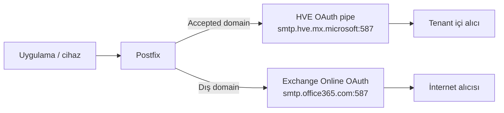

# Postfix Entra Relay

> Microsoft 365 için üretim odaklı, OAuth tabanlı **split mail relay** referans projesi. Postfix; Microsoft 365 tenant içindeki alıcıları **High Volume Email (HVE)** üzerinden, dış alıcıları ise **Exchange Online SMTP AUTH + OAuth** üzerinden gönderir.

[English summary](README.en.md) · [Türkçe doküman dizini](docs/tr/README.md) · [Uçtan uca Türkçe kurulum](docs/tr/DEPLOYMENT_GUIDE.md) · [Mimari](docs/tr/01-mimari.md) · [Güvenlik](SECURITY.md) · [Git yayını](docs/tr/16-git-yayinlama.md)

## Ne çözer?

Uygulamalar, yazıcılar, santraller, rapor servisleri ve eski cihazlar genellikle tek bir SMTP relay'e mail bırakır. Normal Exchange Online SMTP AUTH yolu mailbox başına hız ve günlük alıcı sınırlarına tabidir. HVE ise yüksek hacimli **tenant içi** mail için ayrı bir yoldur. Bu proje iki yolu Postfix üzerinde alıcı bazında birleştirir:



## Temel davranış

| Trafik | SMTP yolu | Kimlik | Görünen From | Not |
|---|---|---|---|---|
| Tenant içi | `smtp.hve.mx.microsoft:587` | HVE MailUser + Entra uygulaması | HVE hesabı | Orijinal sender özel başlıklarda korunur |
| Tenant dışı | `smtp.office365.com:587` | Lisanslı relay mailbox + delegated OAuth | Orijinal uygulama/cihaz adresi | Relay mailbox üzerinde açık SendAs gerekir |

Aynı iletide hem iç hem dış alıcı varsa Postfix `transport_maps` ile teslimatları ayırır.

## Üretimde doğrulanan HVE davranışı

Canlı testlerde:

- HVE hesabı kendi SMTP/MIME From adresiyle başarıyla gönderdi.
- HVE kimliğiyle farklı `MAIL FROM` kullanımı `5.7.62` ile reddedildi.
- Envelope sender HVE iken farklı MIME `From:` kullanımı `5.6.241` ile reddedildi.
- HVE olmayan kullanıcıyı HVE authentication identity yapmak `5.2.240` ile reddedildi.

Bu nedenle iç HVE kopyasının görünen `From` adresi HVE hesabına çevrilir. Orijinal değerler:

```text
X-Postfix-Entra-Original-From
X-Postfix-Entra-Original-Envelope-From
X-Postfix-Entra-Route: internal-hve
```

başlıklarında korunur. Dış kopyada From değiştirilmez.

## Repo içeriği

```text
docs/                  Mimari, M365, Postfix, işletim ve troubleshooting
config/                Güvenli örnek yapılandırmalar
scripts/linux/          Kurulum, doğrulama, transport üretimi ve secret scan
scripts/powershell/     HVE, OAuth, accepted domain ve SendAs otomasyonu
src/                    HVE pipe sender ve günlük origin raporu
dashboard/              Opsiyonel responsive metrik dashboard'u
examples/               Tamamen redacted örnekler
tests/                  Unit ve güvenlik testleri
```

## Hızlı başlangıç

1. [Ön koşulları kontrol edin](docs/tr/02-onkosullar.md).
2. [Microsoft 365 ve HVE tarafını hazırlayın](docs/tr/03-microsoft-365-kurulumu.md).
3. [Dış OAuth SMTP yolunu hazırlayın](docs/tr/04-dis-oauth-route.md).
4. [Ubuntu/Postfix'i kurun](docs/tr/05-postfix-kurulumu.md).
5. [HVE pipe ve split routing'i devreye alın](docs/tr/06-hve-split-routing.md).
6. [SendAs envanterini yönetin](docs/tr/07-sendas.md).
7. [Arşiv, uyarı ve günlük raporları kurun](docs/tr/08-arsiv-uyari-rapor.md).
8. [Akışı doğrulayın ve dashboard'u kurun](docs/tr/09-dashboard.md).
9. [Public Git yayını öncesi güvenlik kontrolünü uygulayın](docs/tr/16-git-yayinlama.md).

Tek parça rehber: **[docs/tr/DEPLOYMENT_GUIDE.md](docs/tr/DEPLOYMENT_GUIDE.md)**

## Referans limitler

Bu repo limitleri kod içine sabitlemez; Microsoft servis davranışı değişebilir. Doküman hazırlanırken kullanılan güncel referanslar:

- HVE: tenant içi alıcılar, mail başına en fazla 50 recipient, 10 MB; message/recipient rate limit `None` olarak belgelenmiştir.
- Normal SMTP AUTH: en fazla 3 eşzamanlı bağlantı, 30 mesaj/dakika ve 10.000 recipient/gün referans sınırları bulunur.

Ayrıntı ve resmi linkler: [docs/tr/15-referanslar.md](docs/tr/15-referanslar.md).

## Güvenlik

Bu repo gerçek tenant ID, client ID, secret, access/refresh token, müşteri domaini, kişisel e-posta, public IP veya özel log içermez. Production secret dosyalarını Git'e eklemeyin. Özellikle:

```text
*.key
*.pfx
*.pass
hve-oauth.json
token*.json
sasl_passwd*
mail.log*
```

Git dışında tutulmalıdır. Ayrıntı: [SECURITY.md](SECURITY.md).

## Desteklenen referans ortam

- Ubuntu Server 24.04 LTS veya uyumlu Debian türevi
- Postfix 3.8+
- Python 3.11+
- ExchangeOnlineManagement 3.9+
- Microsoft Graph PowerShell
- Microsoft 365 Worldwide tenant
- HVE billing policy durumu `BillingPolicyValid`

## Lisans

MIT. Bu proje Microsoft, Canonical veya Postfix projesinin resmi ürünü değildir. Üretime almadan önce kendi tenant ve iş yükünüzde doğrulayın.
